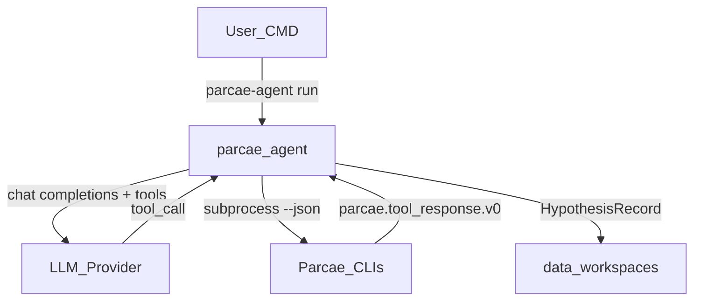

# Phase 4 — CMD agent plan freeze

**Status:** Frozen start of Phase 4 (AI tooling)  
**Upstream:** CUDA parity documented complete (`v0.3.0-cuda-parity`) — see
[`cuda-handoff.md`](cuda-handoff.md), [`cuda-roadmap.md`](cuda-roadmap.md)  
**Product:** `parcae-agent` — a **command-line** Liber Primus tool-use agent  
**Exit tag (planned):** `v0.4.0-agent-tools`

North star:

```text
parcae-agent (CMD)
  → LLM provider (local OpenAI-compatible OR OpenRouter / other APIs)
  → tool calls ONLY to Parcae CLIs (--json)
  → workspace hypotheses
  → never invent transforms outside the catalog
  → never mutate locked fixtures
```

Crypto stays in C++. The LLM only chooses **which allow-listed tools** to call
and how to phrase hypotheses. It MUST NOT reimplement \(\mathbb{Z}_{29}\) math,
scoring, or transforms.



Phase 5 (search engine: GPU → candidates → agents → hypotheses → GPU) is
**out of scope**. Phase 4 delivers the runnable agent + deterministic tool bridge.

## Locked decisions

| Topic | Decision |
|-------|----------|
| Product | `parcae-agent` CLI — Liber Primus tool-use automation (system prompt, tool schemas, budgets) |
| LLM transport | OpenAI-compatible `POST /v1/chat/completions` with tool/function calling |
| Local models | Any OpenAI-compatible server (Ollama, LM Studio, llama.cpp, vLLM, …) via `base_url` + `model` |
| Cloud APIs | OpenRouter and compatible gateways via `base_url` + API key env + `model` |
| Agent language | Python 3.11+ under `agents/parcae_agent/` — **explicit exception** to “no Python orchestration” for the LLM loop only |
| Crypto / scores / transforms | Remain in C++20 CLIs; agent never reimplements them |
| Tool allow-list | tokenize, decode, score, validate, catalog, generate, rank, hypothesis_* |
| Tool deny-list (default) | blind-crack, throughput-tiers, parity-gen, arbitrary shell |
| JSON contract | `parcae.tool_response.v0` on all agent-facing CLIs (success **and** failure) |
| Workspace | `data/workspaces/<id>/` for hypotheses + transcripts; `data/fixtures/` read-only |
| Budgets | max steps, max tool calls, max wall time — hard stop |
| Cursor Skill / MCP | **Not** required for Phase 4 exit (optional later) |
| Exit tag | `v0.4.0-agent-tools` |

## What already exists (do not rebuild)

- Five primitives + id lists: [`include/parcae/tool/api.hpp`](../../include/parcae/tool/api.hpp)
- CLIs under [`tools/`](../../tools/); generators + `TransformCandidate::to_json()`
- Spec seed: [`docs/spec/tools.md`](../spec/tools.md) § Agent-facing stability
- CUDA twins + fused search-run (Phase 3)

## Commit roadmap (granular)

Numbering is **local to Phase 4** (not a continuation of CUDA commits 1–42).

### A — Spec & architecture freeze

| Commit | Title |
|--------|-------|
| 1 | docs: Phase 4 CMD-agent plan freeze (**this**) |
| 2 | docs: normative agent tool surface v0 ([agent-tools.md](../spec/agent-tools.md)) |
| 3 | docs: hypothesis and workspace schema v0 |

### B — Shared JSON / CLI foundation

| Commit | Title |
|--------|-------|
| 4 | feat: ToolResponse JSON helper |
| 5 | feat: wire `--json` envelope on core CLIs (incl. failure envelopes) |
| 6 | feat: enrich tokenize/decode agent JSON (byte spans, rebuild-text, rich score catalog) |
| 7 | feat: search-run agent hygiene (`--omit-timing`, replayable params) |
| 8 | test: JSON envelope CLI goldens |

### C — Catalog / generate / rank

| Commit | Title |
|--------|-------|
| 9 | feat: GeneratorRegistry + list_generator_ids |
| 10 | feat: `parcae-catalog` CLI |
| 11 | feat: tool API `generate_candidates` |
| 12 | feat: `parcae-generate` CLI |
| 13 | feat: tool API `rank_candidates` |
| 14 | feat: `parcae-rank` CLI |
| 15 | test: generate+rank round-trip on `a-warning` |

### D — Hypothesis workspace

| Commit | Title |
|--------|-------|
| 16 | feat: HypothesisRecord load/store |
| 17 | feat: `parcae-hypothesis` CLI |
| 18 | test: hypothesis workspace sandbox |
| 19 | chore: gitignore workspace runtime data |

### E — AgentPolicy

| Commit | Title |
|--------|-------|
| 20 | feat: AgentPolicy guard |
| 21 | feat: apply AgentPolicy in new CLIs |
| 22 | test: AgentPolicy denies fixture writes |

### F — CMD agent `parcae-agent` (Python)

| Commit | Title |
|--------|-------|
| 23 | feat: `agents/` scaffold + provider config (`parcae.agent_config.v0`) |
| 24 | feat: OpenAI-compatible LLM client (local + OpenRouter) |
| 25 | feat: ToolBridge subprocess runner (allow-listed argv only) |
| 26 | feat: tool JSON schemas for LLM function calling |
| 27 | feat: agent loop + Liber Primus system prompt |
| 28 | feat: `parcae-agent` CLI (`run`, `providers test`, `doctor`) |
| 29 | feat: transcript + hypothesis persistence |
| 30 | test: agent loop with mock LLM (CI-safe, no network) |
| 31 | test: provider smoke docs (Ollama + OpenRouter; CI skips live keys) |
| 32 | docs: agent handbook (CMD) |

### G — Exit

| Commit | Title |
|--------|-------|
| 33 | docs: Phase 4 exit checklist |
| 34 | docs: update README goals / non-goals / CUDA status |
| 35 | chore: version **0.4.0** + annotated tag `v0.4.0-agent-tools` |

## Provider sketch (normative intent)

One HTTP adapter; config chooses the endpoint:

```yaml
# Local (e.g. Ollama)
provider:
  base_url: http://127.0.0.1:11434/v1
  api_key_env: null
  model: llama3.1

# OpenRouter
provider:
  base_url: https://openrouter.ai/api/v1
  api_key_env: OPENROUTER_API_KEY
  model: anthropic/claude-sonnet-4
```

Secrets via environment variables named in config — never committed.

## Non-goals (Phase 4)

- Closed-loop GPU search scheduler (Phase 5)
- Multi-agent debate / beam search over hypotheses
- Shipping unsolved LP2 `0`–`55` transcript corpus
- Cursor Skill / MCP as exit requirements
- Live API keys or local GPU models in hosted CI
- Putting `parcae-blind-crack` / `parcae-throughput-tiers` on the default agent allow-list

## Exit criteria (preview)

- Agent-facing CLIs emit `parcae.tool_response.v0` (including failures)
- `catalog` / `generate` / `rank` / `hypothesis` + CPU tests green
- AgentPolicy blocks fixture mutation and path escape
- `parcae-agent run` works against a **mock LLM** in CI
- Documented live paths: local OpenAI-compatible **and** OpenRouter
- Tag `v0.4.0-agent-tools`

## Related

- Tool contracts: [`docs/spec/tools.md`](../spec/tools.md)
- CUDA roadmap (prior phase): [`cuda-roadmap.md`](cuda-roadmap.md)
- Throughput reference (not an agent tool): [`cuda-throughput.md`](cuda-throughput.md)
