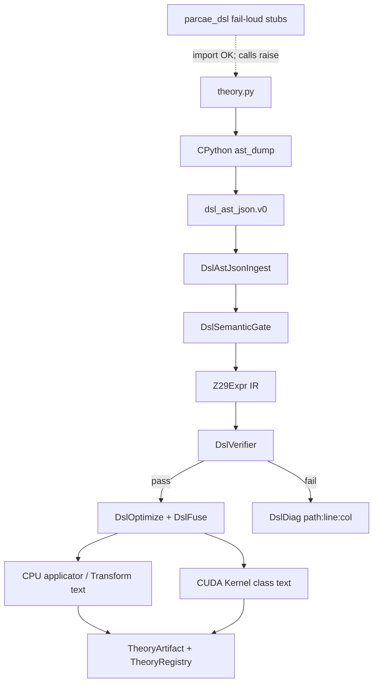

# Python theory DSL → C++/CUDA compiler

**Status:** Architecture guide (implementation follows normative specs)  
**Normative language:** [`docs/spec/dsl.md`](../spec/dsl.md)  
**AST wire format:** [`docs/spec/dsl-ast-json.md`](../spec/dsl-ast-json.md)  
**Artifacts:** [`docs/spec/theory-artifact.md`](../spec/theory-artifact.md)  
**CPU / CUDA context:** [`cpu-reference.md`](cpu-reference.md), [`cuda-reference.md`](cuda-reference.md), [`cuda-throughput.md`](cuda-throughput.md)

This document describes how Parcae compiles theory sources written in a
Python-looking DSL into the existing C++20 + CUDA toolkit — with **speed** on
the verify/emit path and **developer experience** at the editor.

It does **not** replace frozen CUDA or agent docs. Crypto remains C++-first
(same stance as the rest of the toolkit; the LLM agent is a separate Python
exception under `agents/`).

---

## Goals

| Goal | How |
|------|-----|
| DX | Authors write `.py` theories (decorators, annotations) matching examples under `theories/examples/` |
| Speed | Exhaustive/fuzz verify, optimize, fuse, emit run in **C++20** using `Z29` / twin patterns |
| Correctness by construction | One IR → CPU applicator + CUDA twin; hard verify gates; no “compile with warnings” |
| Project fit | Classes + header guards, `tools/parcae-*` CLIs, registries like `GeneratorRegistry`, emitted CUDA under `Parcae/Parcae/cuda/emitted/` |
| No fake verification | IDE stubs fail-loud; only `parcae-compile` produces ready artifacts |

---

## Non-goals

- Hand-written Python lexer/parser in C++ (INDENT/DEDENT tax without IR value)
- CPython inside verify/emit loops
- Replacing Tier-A hand twins until DSL builtins explicitly supersede them
- Closed-loop search/agent scheduling (separate workstream)
- New C++ namespaces

---

## End-to-end flow

```text
theory.py
    │
    ▼  once per compile (not hotpath)
parcae_dsl.ast_dump  /  python -m parcae_dsl.ast_dump
    │  ast.parse → parcae.dsl_ast_json.v0
    ▼
parcae-compile (C++20)
    DslAstJsonIngest     (limits, UTF-8, strict schema)
    DslSemanticGate      (dsl.md whitelist)
    DslBuildIr           (Z29Expr / PrimitiveIr / TheoryIr)
    DslVerifier          (exhaustive | fuzz; hard fail)
    DslOptimize          (const-fold, inv hoist, LaunchPlan)
    DslFuse              (compose inline; fused ≥ staged else fallback)
    DslEmitCpu / DslEmitCuda
    │
    ▼
data/theories/<name>/<ver>/  +  parcae://theories/<name>@<ver>
```



---

## Locked design choices

### CPython is syntax-only

`ast.parse` handles real Python grammar (indentation, strings, decorators,
`Param[int]`). The dump is `parcae.dsl_ast_json.v0`. After that, the process is
pure C++.

### Stubs are not a compiler

Package layout: [`python/`](../../python/) provides `parcae.dsl.*` for IDE
autocomplete. Import succeeds; any semantic execution raises with an instruction
to run `parcae-compile`. See [dsl.md](../spec/dsl.md) § IDE stubs and the
operator guide [dsl-stubs.md](dsl-stubs.md).

`python -m parcae.dsl.ast_dump` is syntax-only (wire format) and also does **not**
verify theories.

### Dual lower targets

| Target | Role |
|--------|------|
| CPU | `DslIrApplicator` (`apply_into` from IR) + optional emitted `class …Transform` sources |
| CUDA | Emitted `class …Device` / `class …Kernel` using `Z29Device`, grids from existing twins (1D `C·T/256`, 2D hist, compose ping-pong) |

### Verify gates

Arity ≤ 4 \(\mathbb{Z}_{29}\) params → full domain enumeration. Larger → fuzz
seed `0xC1CADA`. Totality + determinism + CPU/CUDA-mirror parity. Failure aborts
compile.

### Fusion

`ComposedTheory` chains: try fused kernel; if fused throughput &lt; staged
(CPU `DslFuse::bench_cpu` / ThroughputTiers-style compose protocol), write
`fusion.status = "fallback_staged"` and keep ping-pong compose. Verify still
hard-fails independently.

### Spec vs artifact versions

Artifacts embed `dsl_spec_version`. MAJOR mismatch with
`DslSpecVersion::current` → registry/validate/sweep **reject** (recompile
required). Details: [dsl.md](../spec/dsl.md), [theory-artifact.md](../spec/theory-artifact.md).

---

## Module map (planned)

Fits the layout in [cpu-reference.md](cpu-reference.md):

```text
include/parcae/dsl/
  dsl_spec_version.hpp
  dsl_diag.hpp
  dsl_ast.hpp
  dsl_ast_json_ingest.hpp
  dsl_semantic_gate.hpp
  z29_expr.hpp
  primitive_ir.hpp
  theory_ir.hpp
  dsl_build_ir.hpp
  dsl_verifier.hpp
  dsl_optimize.hpp
  dsl_fuse.hpp
  dsl_emit_cpu.hpp
  dsl_emit_cuda.hpp
  theory_artifact.hpp
  theory_registry.hpp
  theory_uri.hpp

tools/
  parcae-compile
  parcae-sweep
  (+ validate/catalog theory extensions)

Parcae/Parcae/cuda/emitted/     # generated twins; do not hand-edit
python/                         # parcae.dsl stubs + ast_dump (not the compiler)
theories/                       # .py sources
data/theories/                  # compiled artifacts
```

### C++ style (HARD)

Same rule as recent toolkit work: **no new namespaces**. One class per header:

```cpp
#ifndef NAME_HPP
#define NAME_HPP
class Name {
public:
  // ...
private:
  Name() = delete;
};
#endif // NAME_HPP
```

Anonymous namespaces **only** inside `.cu` files for `__global__` kernels
(existing twin convention). Public API remains top-level classes.

---

## CLI surface

| Binary | Role |
|--------|------|
| `parcae-compile` | Spawn AST dump → C++ pipeline → artifact |
| `parcae-validate` | Manifest integrity + spec version + optional re-verify |
| `parcae-sweep` | Sweep from artifact metadata only |
| `parcae-catalog --theories` | List URIs; mark `stale_spec` |

JSON UX aligns with `parcae.tool_response.v0` where tools are agent-facing
([tools.md](../spec/tools.md), [agent-tools.md](../spec/agent-tools.md)).

---

## Relation to existing CUDA twins

Emitted kernels **reuse** patterns documented in [cuda-abi.md](cuda-abi.md) and
[cuda-throughput.md](cuda-throughput.md):

- `Z29Device` for arithmetic
- Batch flat grids vs fused χ² 2D grids (`HistFast` / family chi2)
- Compose staged path via `ComposeDriver` when fusion falls back
- Hand-written `FamilyChi2Batch::launch_atbash_caesar_async` remains until a
  deliberate migration; new compose theories go through `DslFuse`

Host-materialized buffers (totient shifts, permutation tables) stay host-side —
same rule as today’s totient twin.

---

## Ingest hardening

Community `.py` / hostile JSON must not crash the compiler:

- Size/depth/string/node limits in [dsl-ast-json.md](../spec/dsl-ast-json.md)
- Strict schema mode; UTF-8 validation; no UB on malformed input
- Semantic gate rejects forbidden AST kinds even if CPython emitted them
- Dedicated ingest fuzz tests (exit 0/1 + diagnostics only)

---

## Exit checklist (compiler workstream)

- [ ] Specs: dsl, dsl-ast-json, theory-artifact (normative)
- [ ] `parcae-compile` on `theories/examples/new_math_example.py` and
      `full_lifecycle_example.py`
- [ ] Exhaustive gate for arity-4 demo primitive (`poly2_mod29`)
- [ ] Fail-loud stub tests
- [x] Stale `dsl_spec_version` rejected by registry/validate
- [ ] Emitted CUDA uses class + header-guard style
- [ ] Fusion or `fallback_staged` recorded for compose example
- [ ] No `phase*` names in new paths/artifacts

---

## Document history

Architecture companion to the DSL specs. Implementation commits land headers
under `include/parcae/dsl/` and CLIs under `tools/` as described above.
