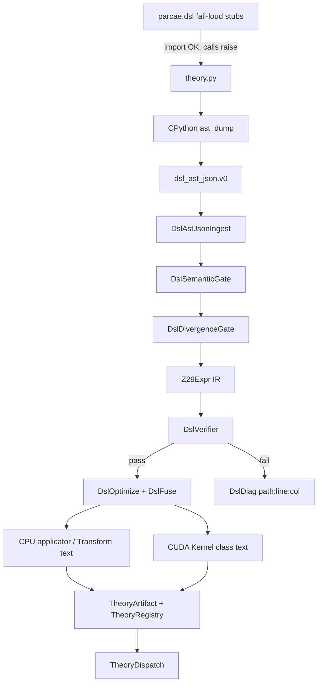
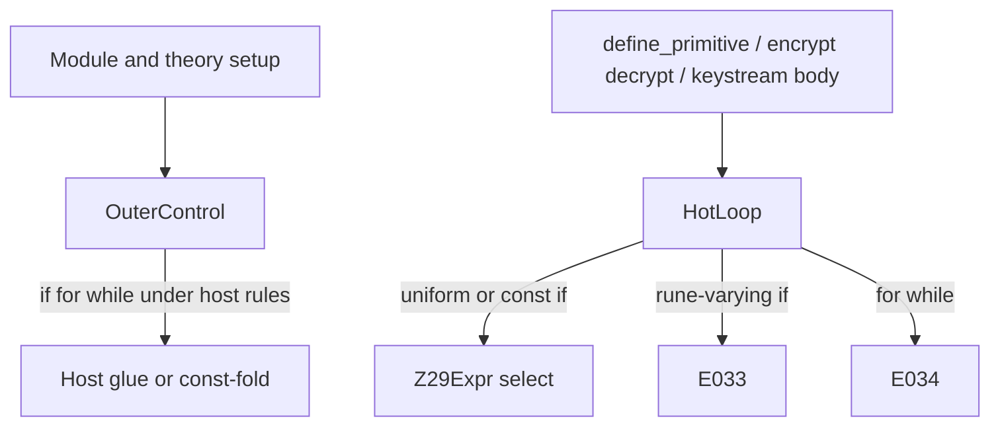

# Python theory DSL → C++/CUDA compiler

**Status:** Architecture guide (implementation matches normative specs unless noted)  
**Normative language:** [`docs/spec/dsl.md`](../spec/dsl.md)  
**AST wire format:** [`docs/spec/dsl-ast-json.md`](../spec/dsl-ast-json.md)  
**Artifacts:** [`docs/spec/theory-artifact.md`](../spec/theory-artifact.md)  
**Index:** [`README.md`](README.md) (architecture hub)  
**CPU / CUDA context:** [`cpu-reference.md`](cpu-reference.md), [`cuda-reference.md`](cuda-reference.md), [`cuda-throughput.md`](cuda-throughput.md), [`cuda-build.md`](cuda-build.md)

This document describes how Parcae compiles theory sources written in a
Python-looking DSL into the existing C++20 + CUDA toolkit — with **speed** on
the verify/emit path and **developer experience** at the editor.

It does **not** replace frozen CUDA or agent docs. Crypto remains C++-first
(same stance as the rest of the toolkit; the LLM agent is a separate Python
exception under `agents/`).

---

## Goals

| Goal | How |
|------|-----|
| DX | Authors write `.py` theories (decorators, annotations) under [`theories/examples/`](../../theories/examples/) |
| Speed | Exhaustive/fuzz verify, optimize, fuse, emit run in **C++20** using `Z29` / twin patterns |
| Correctness by construction | One IR → CPU applicator + CUDA twin; hard verify gates; no “compile with warnings” |
| Project fit | Classes + header guards, `tools/parcae-*` CLIs, registries; emitted CUDA under `Parcae/Parcae/cuda/emitted/` |
| No fake verification | IDE stubs fail-loud; only `parcae-compile` produces ready artifacts |

---

## Non-goals

- Hand-written Python lexer/parser in C++ (INDENT/DEDENT tax without IR value)
- CPython inside verify/emit loops
- Replacing Tier-A hand twins until DSL builtins explicitly supersede them
- Closed-loop search/agent scheduling (separate workstream)
- New C++ namespaces
- Silent accept of artifacts with mismatched `dsl_spec_version` MAJOR

---

## End-to-end flow

```text
theory.py
    │
    ▼  once per compile (not hotpath)
python -m parcae.dsl.ast_dump
    │  ast.parse → parcae.dsl_ast_json.v0
    ▼
parcae-compile (C++20)
    DslAstJsonIngest     (limits, UTF-8, strict schema)
    DslSemanticGate      (dsl.md whitelist; scope-aware control flow — see below)
    DslDivergenceGate    (HotLoop If → E033 / W011)
    DslHostGlue          (OuterControl for/while → HostGlueIr / E035)
    DslBuildIr           (Z29Expr / PrimitiveIr / TheoryIr / ComposeIr)
    DslVerifier          (exhaustive | fuzz; hard fail)
    DslOptimize          (const-fold, inv hoist, LaunchPlan, peak sanity)
    DslFuse              (compose inline; fused ≥ staged else fallback)
    DslEmitCpu / DslEmitCuda
    TheoryArtifact::store
    │  + envelope.json + apply_ir.json
    ▼
data/theories/<name>/<ver>/  +  parcae://theories/<name>@<ver>
    │
    ▼  runtime
TheoryDispatch           (catalog → ApplyTransform; URI → apply_ir + DslIrApplicator)
```



---

## Locked design choices

### CPython is syntax-only

`ast.parse` handles real Python grammar (indentation, strings, decorators,
`Param[int]`). The dump is `parcae.dsl_ast_json.v0` (`dsl_ast_json_version`
**1.1.0**). `#ignore DSL_FLAG:…` comments are collected via `tokenize` into a
top-level `directives[]` array (see [dsl-ast-json.md](../spec/dsl-ast-json.md)).
After that, the process is pure C++.

### Stubs are not a compiler

Package layout: [`python/`](../../python/) provides `parcae.dsl.*` for IDE
autocomplete. Import succeeds; any semantic execution raises with an instruction
to run `parcae-compile`. See [dsl.md](../spec/dsl.md) § IDE stubs and the
operator guide [dsl-stubs.md](dsl-stubs.md).

`python -m parcae.dsl.ast_dump` is syntax-only (wire format) and also does **not**
verify theories.

### Dual lower targets

| Target | Role |
|--------|------|
| CPU | `DslIrApplicator` (`apply_into` from IR) + optional emitted `class …Transform` sources |
| CUDA | Emitted `class …Kernel` using `Z29Device`, grids from existing twins (1D `C·T/256`); golden smoke twin `DslSmokeCaesarKernel` |

### Verify gates

Arity ≤ 4 \(\mathbb{Z}_{29}\) params → full domain enumeration. Larger → fuzz
seed `0xC1CADA`. Totality + determinism + CPU/CUDA-mirror parity. Failure aborts
compile.

### Fusion

`ComposedTheory` chains: try fused kernel; if fused throughput &lt; staged
(CPU `DslFuse::bench_cpu` / ThroughputTiers-style compose protocol), write
`fusion.status = "fallback_staged"` and keep ping-pong compose. Verify still
hard-fails independently. Runtime CPU apply uses fused IR in `apply_ir.json`
even when emit selected staged.

### Spec vs artifact versions

Artifacts embed `dsl_spec_version`. MAJOR mismatch with
`DslSpecVersion::current` → registry/validate/sweep **reject** (recompile
required). Catalog lists stale entries with `stale_spec: true`. Details:
[dsl.md](../spec/dsl.md), [theory-artifact.md](../spec/theory-artifact.md).

### Execution scopes (OuterControl vs HotLoop)

Normative contract: [dsl.md](../spec/dsl.md) § Execution scopes.

The compiler **must** distinguish host/setup code from per-rune math so that
`if` / `for` / `while` can exist for theory configuration without opening
thread-divergent CUDA hot paths.



| Scope | Typical regions | Control flow |
|-------|-----------------|--------------|
| **OuterControl** | Module body; `step_params`; structural helpers | `if` / bounded `for` / finite `while` → host glue or compile-time unroll |
| **HotLoop** | Primitive bodies; encrypt/decrypt/keystream steps | Branch-free / uniform `if` only; no loops by default |

**Landed:** `DslExecScope`, `DslScopeAnalyzer`, scope-aware `DslSemanticGate` (E034),
`DslDivergenceGate` (E033 / W011), `DslHostGlue` / `HostGlueIr` (E035),
`Z29Expr::Select` + applicator eval + `DslOptimize` dead-arm fold.

**Planned classes** (not all landed yet; names are stable targets):

| Class | Role |
|-------|------|
| `DslExecScope` | Scope kind + loop depth |
| `DslScopeAnalyzer` | Walk AST JSON → scope map |
| `DslSemanticGate` | Whitelist + scope-aware `If`/`For`/`While`/`Break`/`Continue` (HotLoop loops → **E034**) |
| `DslDivergenceGate` | HotLoop predicate class → **E033** / **W011** |
| `DslHostGlue` / `HostGlueIr` | OuterControl `for`/`while`/`if` → host IR; unbounded → **E035** |
| `DslDirectiveTable` | `#ignore DSL_FLAG:…` binding (follow-on) |

`DslSemanticGate` runs `DslScopeAnalyzer` first, then applies the control-flow
table in [dsl.md](../spec/dsl.md) § Execution scopes. `DslDivergenceGate` classifies
HotLoop `If.test` as CompileTimeConstant / LoopInvariant / HostFlag / ThreadVarying;
ThreadVarying → **E033**, relaxed accepts → **W011**. HotLoop relaxed `if` lowers
to `Z29Expr::Select` in BuildIr (statement `If` / `elif` / `else`, and `IfExp`).

**`DslFuse` reminder:** fuse only inlines `ComposedTheory` chains and chooses
fused vs staged emit. It does **not** own Python control-flow policy — that sits
in scope analysis + semantic/divergence gates **before** fuse.

### Envelope bridge + dispatch

| File | Role |
|------|------|
| `envelope.json` | Catalog `TransformEnvelope` **or** `parcae://theories/…` URI extension |
| `apply_ir.json` | `parcae.theory_apply_ir.v0` — encrypt/decrypt trees for CPU apply |
| `TheoryDispatch` | Catalog → `ApplyTransform`; theory URI → load `apply_ir` + `DslIrApplicator` |

Catalog-only tools **MUST** fail clearly on theory URIs (no silent no-op).
See [theory-artifact.md](../spec/theory-artifact.md) § Envelope bridge.

---

## Module map (implemented)

Fits the layout in [cpu-reference.md](cpu-reference.md). Header index:
[`include/parcae/dsl/README.md`](../../include/parcae/dsl/README.md).

```text
include/parcae/dsl/
  dsl_spec_version.hpp / dsl_ast_json_version.hpp
  dsl_diag.hpp / dsl_rule_id.hpp
  dsl_ast*.hpp / dsl_ast_json_ingest.hpp / dsl_semantic_gate.hpp
  z29_expr.hpp / param_ir.hpp / primitive_ir.hpp / theory_ir.hpp / compose_ir.hpp
  dsl_build_ir.hpp / dsl_ir_applicator.hpp
  dsl_verifier.hpp / dsl_optimize.hpp / dsl_fuse.hpp
  dsl_launch_plan.hpp / dsl_peak_sanity.hpp
  dsl_emit_cpu.hpp / dsl_emit_cuda.hpp / dsl_catalog_builtins.hpp
  theory_uri.hpp / theory_artifact.hpp / theory_registry.hpp
  theory_validate.hpp / theory_sweep.hpp
  theory_envelope_bridge.hpp / theory_apply_ir.hpp / theory_dispatch.hpp
  dsl_compile.hpp / dsl.hpp

tools/
  parcae-compile / parcae-validate / parcae-sweep / parcae-catalog

Parcae/Parcae/cuda/
  emitted/                  # generated twins (gitignored except README)
  dsl_smoke_caesar_kernel.* # golden [cuda][dsl][smoke] twin

python/parcae/dsl/          # stubs + ast_dump (not the compiler)
theories/examples/          # authoring sources (new_math, full_lifecycle)
data/theories/              # compiled artifacts
```

### C++ style (HARD)

Same rule as recent toolkit work: **no new namespaces**. One class per header:

```cpp
#ifndef NAME_HPP
#define NAME_HPP
class Name {
public:
  // ...
private:
  Name() = delete;
};
#endif // NAME_HPP
```

Anonymous namespaces **only** inside `.cu` files for `__global__` kernels
(existing twin convention). Public API remains top-level classes.
Artifact and emit paths use stable theory/component names — never numbered-stage
prefixes in new paths or artifact filenames.

---

## Examples

| Source | URI after `@1` compile | Notes |
|--------|------------------------|-------|
| [`theories/examples/new_math_example.py`](../../theories/examples/new_math_example.py) | `parcae://theories/quadratic_polynomial_stream@1` | Tier B keyed_stream; `poly2_mod29` |
| [`theories/examples/full_lifecycle_example.py`](../../theories/examples/full_lifecycle_example.py) | `parcae://theories/koan1_style@1` | Tier A `@ComposedTheory` (atbash+caesar) |

```text
parcae-compile theories/examples/new_math_example.py
parcae-validate --theory parcae://theories/quadratic_polynomial_stream@1
parcae-catalog --theories --json
```

---

## CLI surface

| Binary | Role |
|--------|------|
| `parcae-compile` | Spawn AST dump → C++ pipeline → artifact (`envelope.json`, `apply_ir.json`, CPU/CUDA text) |
| `parcae-validate --theory` / `--theories` | Manifest + `dsl_spec_version` + path files + envelope/apply_ir content |
| `parcae-sweep` | Expand `sweep.param_grid` plan-only (no apply/score) |
| `parcae-catalog --theories` | List URIs; mark `stale_spec` |

JSON UX aligns with `parcae.tool_response.v0` where tools are agent-facing
([tools.md](../spec/tools.md), [agent-tools.md](../spec/agent-tools.md)).

Runtime apply helpers: `TheoryDispatch` and
`parcae::tool::apply_to_indices(..., TheoryEnvelopeBridge::Envelope, theories_root)`.

---

## Relation to existing CUDA twins

Emitted kernels **reuse** patterns documented in [cuda-abi.md](cuda-abi.md) and
[cuda-throughput.md](cuda-throughput.md):

- `Z29Device` for arithmetic
- Batch flat grids vs fused χ² 2D grids (`HistFast` / family chi2)
- Compose staged path via `ComposeDriver` when fusion falls back
- Hand-written `FamilyChi2Batch::launch_atbash_caesar_async` remains until a
  deliberate migration; new compose theories go through `DslFuse`
- Smoke: Catch2 `[cuda][dsl][smoke]` — emit text always; device parity when
  `PARCAE_BUILD_CUDA=ON` ([cuda-build.md](cuda-build.md))

Host-materialized buffers (totient shifts, permutation tables) stay host-side —
same rule as today’s totient twin.

---

## Ingest hardening

Community `.py` / hostile JSON must not crash the compiler:

- Size/depth/string/node limits in [dsl-ast-json.md](../spec/dsl-ast-json.md)
- Strict schema mode; UTF-8 validation; no UB on malformed input
- Semantic gate rejects forbidden AST kinds even if CPython emitted them
- Dedicated ingest fuzz tests (exit 0/1 + diagnostics only)

---

## Exit checklist (compiler workstream)

- [x] Specs: dsl, dsl-ast-json, theory-artifact (normative)
- [x] `parcae-compile` on `theories/examples/new_math_example.py`
- [x] `parcae-compile` on `theories/examples/full_lifecycle_example.py`
- [x] Exhaustive gate for arity-4 demo primitive (`poly2_mod29`)
- [x] Fail-loud stub package + operator guide ([dsl-stubs.md](dsl-stubs.md))
- [x] Stale `dsl_spec_version` rejected by registry/validate
- [x] Emitted CUDA uses class + header-guard style
- [x] Fusion or `fallback_staged` recorded for compose example
- [x] Envelope bridge + `TheoryDispatch` / `apply_ir.json`
- [x] `[cuda][dsl][smoke]` emit text + `DslSmokeCaesarKernel` golden twin
- [x] Architecture hub links this guide ([README.md](README.md))
- [x] Stub runtime raises `ParcaeDslStubError` (`python/tests/test_stubs_fail_loud.py`)
- [x] CI compiles `theories/examples` + rejects stale fixture
      (`.github/workflows/ci.yml` gates + `scripts/check-dsl-examples.sh`)
- [x] Toolkit version **0.5.0** (`v0.5.0-theory-dsl`)
- [x] Artifact paths use stable names (no numbered-stage prefixes in DSL paths)

**Smart-compiler follow-on (docs first):** OuterControl vs HotLoop is normative in
[dsl.md](../spec/dsl.md) § Execution scopes; implementation classes listed under
§ Execution scopes above. Not part of the `v0.5.0-theory-dsl` exit.

**Exit:** compiler workstream complete at toolkit 0.5.0.

---

## Document history

Architecture companion to the DSL specs. Headers live under
`include/parcae/dsl/`; CLIs under `tools/`; examples under `theories/examples/`.
