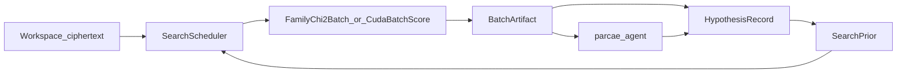

# Search engine plan freeze

**Status:** Frozen start of Liber Primus **search engine** (closed loop)  
**Upstream:** CUDA parity (`v0.3.0-cuda-parity`) + Theory DSL (`v0.5.0-theory-dsl`) +
CMD agent tooling ([`agent-tooling.md`](agent-tooling.md), planned exit
`v0.6.0-agent-tools`)  
**Product:** `SearchScheduler` (C++20) + `parcae-search-cycle` CLI — workspace-driven
GPU/CPU candidate cycles with hypothesis feedback  
**Exit tag (planned):** `v0.7.0-search-engine`  
**Normative schema:** [`docs/spec/search-loop.md`](../spec/search-loop.md)

North star:

```text
workspace ciphertext
    → GPU fused / batched search   (CPU fallback for CI)
    → TransformCandidate top-k artifact
    → agent (optional) + HypothesisRecord
    → priors / exclusions / promoted seeds
    → next GPU batch
```



Crypto math stays in C++/CUDA. The LLM never invents transforms; it only
interprets allow-listed tool results and proposes/rejects hypotheses under
[`AgentPolicy`](../../include/parcae/tool/agent_policy.hpp).

This workstream **owns** the closed loop that agent-tooling explicitly deferred
(GPU → candidates → agents → hypotheses → GPU).

---

## Locked decisions

| Topic | Decision |
|-------|----------|
| **C++ / CUDA style (HARD)** | **No `namespace`s.** One top-level `class Name { public: … private: … };` per header with `#ifndef NAME_HPP` / `#endif // NAME_HPP`. Prefer static methods on a class over free functions. Same for new CUDA host façades. |
| Orchestrator language | **C++20 library + CLI** (`SearchScheduler`). Python `parcae-agent` remains LLM tool chooser only — **no** Python search scheduler. |
| Primary ciphertext source | Workspace [`parcae.workspace.v0`](../spec/hypothesis-workspace.md) `input` (`fixture_ciphertext` \| `workspace_file`). Fixtures under `data/fixtures/` stay **read-only**. |
| GPU core | Reuse [`FamilyChi2Batch`](../../Parcae/Parcae/cuda/family_chi2_batch.hpp) / `CudaBatchScore` / existing SoA ABIs — do **not** fork a second batch stack. |
| Candidate wire format | Existing [`TransformCandidate`](../../include/parcae/generate/transform_candidate.hpp) + `TransformEnvelope` JSON. |
| Batch result artifact | Schema `parcae.batch_artifact.v0` under `data/workspaces/<id>/batches/<batch_id>/` (manifest + `candidates.jsonl` + optional report). |
| Hypothesis bridge | Top-k → draft/proposed hypotheses (auto and/or agent); store `source.batch_id`, `source.candidate_id`, family / generator provenance. |
| Feedback | `SearchPrior`: `promoted` → seed envelopes; `rejected` → exclusion keys (param hash). v0: hard include/exclude only (no soft weights). |
| Determinism | Same inputs + seed + job JSON ⇒ same candidate order ([`BatchOrdering`](../../include/parcae/batch/)) and same artifact digests. Timing fields optional; agent JSON uses `--omit-timing`. |
| Agent allow-list | New tool `search_cycle` → binary `parcae-search-cycle`. Keep `search-run` / `throughput-tiers` / `blind-crack` on the **deny-list** by default. |
| CUDA in CI | Hosted CI stays `PARCAE_BUILD_CUDA=OFF`. CPU search path **MUST** be tested in CI (`Gate [search]` on the matrix in [`ci.yml`](../../.github/workflows/ci.yml)). GPU parity path: local / optional self-hosted. |
| English in source | All new claims, strings, comments, and docs in English. |
| Naming | Descriptive kebab paths only (`search-engine.md`, `search-loop.md`, …). **No** numbered-stage prefixes in paths, docs, tags, or CI job names. |
| Exit tag | `v0.7.0-search-engine` (toolkit version **0.7.0**) |

---

## What already exists (do not rebuild)

| Piece | Path / note |
|-------|-------------|
| Fused GPU χ² | [`FamilyChi2Batch`](../../Parcae/Parcae/cuda/family_chi2_batch.hpp), [`SearchRun`](../../include/parcae/run/search_run.hpp) / `SearchRunCuda` — **metrics/sweeps**, not candidate export |
| Staged batch + score | `CandidateBatchBuffers`, `CudaBatchScore`, `*_batch_kernel.*` |
| CPU generate / rank | [`GenerateCandidates`](../../include/parcae/tool/generate_candidates.hpp), [`RankCandidates`](../../include/parcae/tool/rank_candidates.hpp) — CPU default; optional `backend=cuda` via `CudaScore` |
| Agent loop | [`agents/parcae_agent/`](../../agents/parcae_agent/) — deny-list includes `parcae-search-run` |
| Hypotheses | [`HypothesisRecord`](../../include/parcae/hypothesis/hypothesis_record.hpp), `parcae-hypothesis` |
| Theory DSL | `include/parcae/dsl/`, `TheoryDispatch` — single-stream apply, **not** a batch scheduler |
| Throughput SLOs | [`parcae-throughput-tiers`](cuda-throughput.md) — research/SLO only, not the loop |

**Gap this freeze closes:** no orchestrator, no GPU → `TransformCandidate` export for
agents/workspaces, no hypothesis → next-batch prior, no workspace-driven search
input for fused families.

---

## Module map (new)

```text
include/parcae/search/
  search_job.hpp             # SearchJob — family, score_id, k, seed, grid/priors
  search_prior.hpp           # SearchPrior — seeds + exclusions from hypotheses
  batch_artifact.hpp         # BatchArtifact — parcae.batch_artifact.v0
  hypothesis_bridge.hpp      # HypothesisBridge — candidates ↔ HypothesisRecord
  search_scheduler.hpp       # SearchScheduler — one cycle or multi-iteration
  gpu_candidate_export.hpp   # GpuCandidateExport — fused/staged → TransformCandidate[]
  workspace_cipher.hpp       # WorkspaceCipher — resolve workspace.v0 → Index29
  search.hpp                 # optional umbrella include (no namespaces)

tools/parcae_search_cycle/   # CLI: one/N cycles on a workspace (--json)

docs/architecture/search-engine.md      # this freeze
docs/architecture/search-roadmap.md     # commit list mirror (commit 3)
docs/architecture/search-handbook.md    # operator guide
docs/spec/search-loop.md                # normative contracts (commit 2)
```

---

## Data contracts

Normative detail: [`docs/spec/search-loop.md`](../spec/search-loop.md)
(`parcae.search_job.v0`, `parcae.batch_artifact.v0`, `parcae.search_prior.v0`,
`parcae.search_cycle_result.v0`). Summary:

### `SearchJob`

- Fields: `workspace_id`, `family` (`caesar` \| `atbash` \| `atbash_caesar` \|
  `affine` \| `vigenere` \| `compose`; opt-in `beaufort` / `totient` via `allow_extended_families`;
  opt-in `theory` via `allow_theory_uri` + explicit `params_list`), `score_id`, `k`,
  `seed`, `backend` (`cpu` \| `cuda`), `max_candidates`, optional `param_grid` /
  prior reference.
- MUST resolve ciphertext via workspace manifest only.

### `parcae.batch_artifact.v0`

```text
data/workspaces/<id>/batches/<batch_id>/
  manifest.json       # schema, job digest, score_id, backend, created_utc, count
  candidates.jsonl    # one TransformCandidate JSON per line, rank order
  report.json         # optional; omit timing in agent mode
```

### `SearchPrior`

- `promoted` hypotheses → seed envelopes / param hints.
- `rejected` → exclusion keys (canonicalized param hash).
- Never read fixture **plaintext** for unsolved LP2 workspaces.
  Operator layout: [`search-handbook.md`](search-handbook.md) § LP2 workspace
  recipe (`inputs/` + `workspace_file`).

### Cycle semantics (v0)

1. Build job from workspace + prior.
2. Expand / fused-score on GPU, or CPU generators as fallback.
3. Write `BatchArtifact`.
4. `HypothesisBridge` ingests top-k → draft/proposed hypotheses (idempotent ids).
5. Optional: `--with-agent` for interpret / propose / reject within budget.
6. Rebuild prior; if iterations remain, goto 1.

**Stop when:** `max_iterations`, wall budget, no new candidates, or promotion /
validate success (same spirit as agent success criteria).

---

## GPU ↔ candidate bridge

[`SearchRun`](../../include/parcae/run/search_run.hpp) returns metrics and sweep
steps — **not** agent candidates. New `GpuCandidateExport`:

- Bounded families (Caesar 29, Affine 812, …): fused χ² scores-only → host top-k
  lanes → materialize `TransformCandidate` (envelope + preview apply **only** for
  top-k — never full C×T D2H).
- Missing fused path: staged SoA + `CudaBatchScore`.
- CPU oracle: same job via `GenerateCandidates` + `RankCandidates` must match
  top-k **ids** (and scores under [`cuda-score-reduction.md`](cuda-score-reduction.md)).

Optional: `RankCandidates` CUDA backend (`backend=cuda`) for large **already-materialized**
lists — CPU remains source of truth for small-N agent generate/rank.

---

## Agent integration (intent)

- Allow-list: `search_cycle` → `parcae-search-cycle`.
- Deny-list unchanged for `search-run`, `throughput-tiers`, `blind-crack`
  (`search-run` = metrics / fused-sweep dashboard via `SearchRun`, not candidate
  export — [`agent-tools.md`](../spec/agent-tools.md) § `search_cycle` vs
  `parcae-search-run`; `blind-crack` = locked-fixture foothold bench, not the
  workspace loop — § `search_cycle` vs `parcae-blind-crack`).
- Mirror in [`agents/parcae_agent/allowlist.py`](../../agents/parcae_agent/allowlist.py),
  `tool_schemas.py`, and C++ `AgentPolicy`.
- Prompt guidance: prefer `search_cycle` for large grids; keep `generate` + `rank`
  for tiny explicit sets.
- Transcripts may record `batch_id` digests; hypothesis scores MUST NOT store GPU
  tok/s.

---

## Non-goals

- Multi-agent debate / beam search over hypotheses
- Dictionary / unconstrained key search as catalog pollution
- Shipping the full unsolved LP2 `0`–`55` ciphertext corpus in-repo
- Replacing hand CUDA twins with DSL-only kernels
- Hosted CI requiring an NVIDIA GPU
- Cursor Skill / MCP as exit requirements
- Silent accept of non-deterministic agent JSON (timing must be omittable)
- Open-source polish / packaging (separate later workstream)

---

## Exit criteria → `v0.7.0-search-engine`

- [`search-loop.md`](../spec/search-loop.md) + this freeze green
- CI: one workspace **CPU** cycle — job → artifact → hypotheses → prior → second
  iteration, deterministic
- CUDA (local/optional): top-k contract vs CPU on a locked Tier-A fixture
  (e.g. `a-warning`)
- `parcae-search-cycle --json` + agent allow-list mock test
- Root README roadmap marks search loop done with the exit tag
- Toolkit version bump to **0.7.0**

**Version ordering:** cut `v0.6.0-agent-tools` before or immediately before this
exit tag (0.5 DSL → 0.6 agent → 0.7 search). Implementation may start now against
the in-tree agent stack (generate / rank / hypothesis / `AgentLoop`).

---

## Commit roadmap (granular)

Numbering is **local to this search-engine roadmap**. Detailed mirror:
[`search-roadmap.md`](search-roadmap.md).

### A — Spec & architecture freeze

| # | Commit |
|---|--------|
| 1 | docs: search-engine plan freeze (**this**) — **done** |
| 2 | docs: normative search-loop schema v0 (`search-loop.md`) — **done** |
| 3 | docs: search-roadmap + README roadmap pointer — **done** |
| 4 | docs: revise agent-tools allow/deny for `search_cycle` — **done** |

### B — Core C++ types

| # | Commit |
|---|--------|
| 5 | feat(search): `SearchJob` class + JSON parse/validate |
| 6 | feat(search): `SearchPrior` from `HypothesisRecord` statuses |
| 7 | feat(search): `BatchArtifact` writer/loader (`parcae.batch_artifact.v0`) |
| 8 | test(search): Job / Prior / BatchArtifact round-trip |

### C — Workspace ciphertext

| # | Commit |
|---|--------|
| 9 | feat(search): `WorkspaceCipher` load `Index29` from `workspace.v0` |
| 10 | test(search): fixture + workspace_file resolve; path escape reject |

### D — Candidate export

| # | Commit |
|---|--------|
| 11 | feat(search): `GpuCandidateExport` Caesar fused top-k |
| 12 | feat(search): export atbash + atbash_caesar + affine |
| 13 | feat(search): export vigenere bounded / explicit-key grid |
| 14 | feat(search): `CpuCandidateExport` via generate + rank fallback |
| 15 | test(search): CPU vs CUDA top-k parity on `a-warning` (device skip if no CUDA) |

### E — Rank hardening

| # | Commit |
|---|--------|
| 16 | feat(tool): `RankCandidates` optional CUDA score path |
| 17 | feat(cli): `parcae-rank --backend cuda` when allow_cuda |
| 18 | test(tool): rank CUDA/CPU ordering contract |

### F — Hypothesis bridge

| # | Commit |
|---|--------|
| 19 | feat(search): `HypothesisBridge` ingest top-k → draft hypotheses |
| 20 | feat(search): idempotent ids + `source.batch_id` provenance |
| 21 | feat(hypothesis): extend source fields in schema + record |
| 22 | test(search): ingest → `hypothesis_score` / set-status |

### G — Scheduler

| # | Commit |
|---|--------|
| 23 | feat(search): `SearchScheduler::run_once` |
| 24 | feat(search): `SearchScheduler::run_loop` + budgets + stop reasons |
| 25 | feat(search): promoted seeds + rejected exclusions on next job |
| 26 | test(search): two-iteration deterministic CPU loop |

### H — CLI

| # | Commit |
|---|--------|
| 27 | feat(cli): `parcae-search-cycle` scaffold `--json` `--status` |
| 28 | feat(cli): `--workspace` `--iterations` `--backend` |
| 29 | feat(cli): `--omit-timing` + replayable digests |
| 30 | test(cli): JSON golden + AgentPolicy allow path — **done** |

### I — Agent wiring

| # | Commit |
|---|--------|
| 31 | feat(agent): allowlist + schemas for `search_cycle` — **done** |
| 32 | feat(agent): C++ `AgentPolicy` default allow sync — **done** (with H30) |
| 33 | feat(agent): prompts — `search_cycle` vs generate/rank — **done** |
| 34 | test(agent): mock LLM `search_cycle` CI-safe — **done** |
| 35 | docs: search-handbook operator guide — **done** |

### J — Extended families

| # | Commit |
|---|--------|
| 36 | feat(search): optional beaufort/totient families (explicit opt-in) — **done** |
| 37 | feat(search): optional theory-URI job step (top candidates only) — **done** |
| 38 | feat(search): compose recipe jobs (AtbashCaesar / ComposeDriver export) — **done** |
| 39 | test(search): compose job CPU/CUDA mirror smoke — **done** |
| 40 | docs: LP2 workspace recipe (`inputs/`, no fixture plaintext assumption) — **done** |

### K — Research CLIs stay separate

| # | Commit |
|---|--------|
| 41 | docs: clarify `blind-crack` vs `search-cycle` (still deny-listed) — **done** |
| 42 | chore: `search-run` remains metrics CLI; cross-link in `tools.md` — **done** |

### L — CI & quality

| # | Commit |
|---|--------|
| 43 | ci: gate `[search]` CPU scheduler tests on matrix — **done** |
| 44 | test(search): adversarial job JSON / path escape / caps — **done** |
| 45 | test(search): BatchArtifact limits + stable ordering fuzz — **done** |
| 46 | docs: `cuda-build.md` Catch2 tags `[search][scheduler]` — **done** |

### M — Exit

| # | Commit |
|---|--------|
| 47 | docs: search-engine exit checklist green |
| 48 | docs: README roadmap — search loop done (`v0.7.0-search-engine`) |
| 49 | docs: agent-tooling / handbook point here (closed-loop owned by search) |
| 50 | chore: version bump 0.7.0 |
| 51 | test: smoke Version + `parcae-search-cycle --status` |
| 52 | chore: annotated tag `v0.7.0-search-engine` |

---

## Related

| Doc | Role |
|-----|------|
| [`agent-tooling.md`](agent-tooling.md) | CMD agent freeze (tool bridge; deferred the loop) |
| [`agent-handbook.md`](agent-handbook.md) | Agent operator guide |
| [`search-handbook.md`](search-handbook.md) | Search-cycle operator guide |
| [`cuda-reference.md`](cuda-reference.md) | Fused / SoA CUDA map |
| [`cuda-score-reduction.md`](cuda-score-reduction.md) | CPU↔CUDA score compare rules |
| [`hypothesis-workspace.md`](../spec/hypothesis-workspace.md) | Workspace + HypothesisRecord |
| [`agent-tools.md`](../spec/agent-tools.md) | Allow/deny lists (`search_cycle` target contract) |
| [`search-roadmap.md`](search-roadmap.md) | Granular commit list 1–52 |
| [`tools.md`](../spec/tools.md) | CLI contracts |
